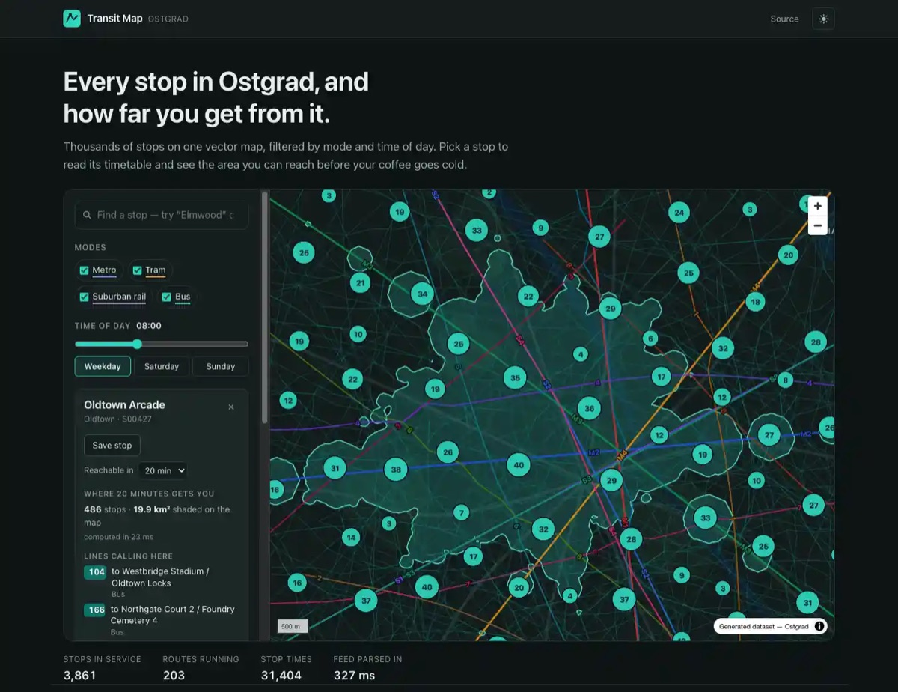

# Transit Map

Every stop in a city on one map, with its timetable and the area you can reach
from it. Pick a stop, choose an hour, and the map shades everywhere the network
gets you to inside a travel budget — the ride, the wait for it and the walk at
either end.

**[Open the demo](https://mrnednick.github.io/transit-map/)** —
[a stop and its 20-minute reach](https://mrnednick.github.io/transit-map/?c=12.4930,49.0090&z=12.30&s=S00427&i=20),
[three in the morning, when ten routes are left](https://mrnednick.github.io/transit-map/?h=3),
[metro and suburban rail only](https://mrnednick.github.io/transit-map/?m=metro,rail).



Svelte 5 · MapLibre GL · PMTiles · TypeScript · Vite. No backend, no map key,
no account: the whole thing is static files.

## What it does

- **Every stop on the map.** 3,960 of them, clustered when zoomed out; clicking
  a cluster zooms to exactly the level where it comes apart.
- **The hour is a slice of the timetable, not a dimmer.** At 08:00 on a weekday
  the map carries 203 routes and 3,861 stops; at 03:00 it is down to the ten
  night routes and the 291 stops they call at.
- **A stop card that reads like a stop.** Which lines call there, where their
  vehicles go, and when the next ones leave — with lines that exist but are not
  running right now marked rather than hidden, and a quiet hour saying so
  instead of showing an empty list.
- **Reachable area.** 10 to 45 minutes of travel, drawn as an outline over the
  map, recomputed when the budget, the hour or the modes change.
- **The link is the view.** Camera, modes, hour, day, the open stop and the
  budget all live in the address bar, so a link opens someone else's screen.
- **Saved stops** survive a reload and stay in step across two open tabs.

## What is interesting inside

**Isochrones, computed in the page.** `src/lib/routing/` holds a small routing
stack. `reach.ts` is a frequency-based RAPTOR: four rounds, each scanning every
pattern that runs in the chosen window once, boarding with half a headway of
expected wait — the average for a passenger who does not read the timetable —
and letting people walk 400 m between nearby stops in between. `isochrone.ts`
turns the result into a walking-time surface on a grid and `contour.ts` cuts
the outline out of it with marching squares, nesting the rings so that holes in
the covered area stay holes and outlying pockets stay separate polygons. The
first area on a page costs 220–270 ms, which includes building the walking
graph once; every one after that is 6–70 ms.

**Labels with no font server.** MapLibre will not draw a label without a glyph
server, and the point of this project was to need no server at all. `map/glyphs.ts`
registers a `localfont://` protocol that rasterises each character into a signed
distance field with TinySDF and encodes it in the same protobuf a font server
would have returned.

**Text that is honest about time.** A feed writes night service as 24:00–29:00,
so every band is tried both where it is printed and one service day earlier —
otherwise the small hours come back empty. A departure the feed describes as a
headway is marked with a tilde, because the vehicle comes about then, not
exactly then.

## Why PMTiles and a committed feed

A slippy map usually means a tile service: an account, a key, a quota, and a
demo that breaks the day the free tier changes. Here the basemap is one
[PMTiles](https://protomaps.com/docs/pmtiles) archive sitting next to the app.
It is a single 328 KB file, and the client reads only the tiles it needs out of
it with HTTP range requests — five requests and about 45 KB for the opening
view. The GTFS feed is committed the same way, as plain CSV.

Opening the map for the first time costs about **685 KB** over the wire:

| | Transferred (gzip) |
| --- | --- |
| App code — mostly MapLibre GL | 347 KB |
| GTFS feed, six files | 292 KB |
| Basemap tiles for the first view | 45 KB |

The feed is generated rather than borrowed: `scripts/build-feed.mjs` writes a
plausible city — 213 routes, 1,462 trip patterns, 31,404 stop times — and
`scripts/build-tiles.mjs` builds the tile archive from the same geometry. That
keeps the repository self-contained and free of anyone else's licence.

## Getting started

```bash
npm install
npm run dev
```

| Script | What it does |
| --- | --- |
| `npm run dev` | development server |
| `npm run build` | production build into `dist/` |
| `npm run preview` | serve the production build locally |
| `npm run check` | Svelte + TypeScript diagnostics |
| `npm run lint` | ESLint |
| `npm test` | Vitest |
| `npm run data` | regenerate the feed and the tile archive |

## Deploy

The site is static, so it deploys as files. `.github/workflows/deploy.yml`
lints, type-checks, tests, builds and publishes to GitHub Pages on every push
to `main`; the demo is at <https://mrnednick.github.io/transit-map/>.

A project page is served from a subdirectory, so the build needs to know it:

```bash
BASE_PATH=/transit-map/ npm run build
```

Anywhere else — Netlify, Vercel, an S3 bucket, a folder behind nginx — takes
`npm run build` and the `dist/` folder as they are, with no environment
variable and nothing to configure. The feed and the tile archive are part of
the build.

## Tests

`npm test` runs 28 tests over a six-stop feed small enough to check by hand:
finding a stop, filtering by mode and hour, reading the card, and the area the
network opens up. The numbers asserted are arithmetic on that fixture — half a
headway plus the ride — rather than whatever the code happened to print.

## Licence

MIT.
